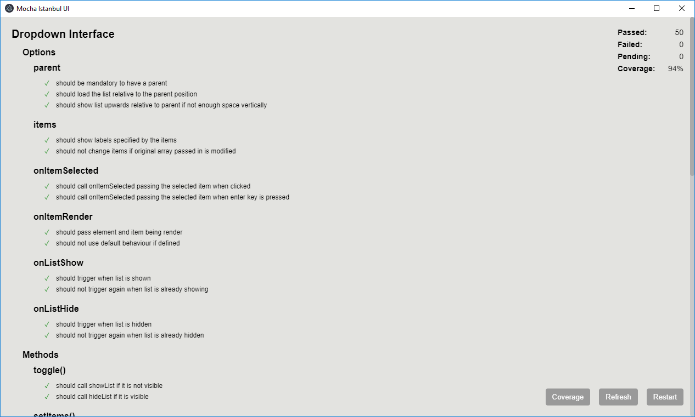

# Mocha Istanbul UI

An Electron-based testing application that runs [Mocha](https://mochajs.org/) tests along with code coverage support provided by [Istanbul](https://istanbul.js.org/).

## Motivation

Prior to running tests in the terminal, tests for web apps used to run in the browser. While the setup was tricky from time to time, the experience was pretty good. You had full access to the real DOM, and have your usual debugging experience. Terminal test runners on the other hand, were easy to setup, but had to use a fake DOM and use a remote-debugger. 

Code coverage was also another problem, typical solutions would require you to generate files to a ```coverage``` directory, and to open them up in your browser. It's far from an ideal experience.

I wanted a tool that would have the ease of using the CLI, with a fully powered DOM, a typical debugging experience, and with live code coverage that I can easily access. 




## Features

* Mocha as a test runner.
* Istanbul format for test coverage.
* Full code coverage available in the UI. See exactly what was covered immediately without needing separate files.
* Watches files for changes and automatically restarts the test cases.
* Supports CI environments with XVFB with options to print to console, run once, and generate coverage files.
* Support for setup scripts to run babel-register (including source maps) and external Istanbul instrumentation.

## How to Run

```npm install mocha-istanbul-ui```

```
{
    "test": "mocha-istanbul-ui <glob-pattern> [--flags]
} 
```

eg. ```mocha-istanbul-ui setup.js "src/*.spec.js" --instrument```

## Options

**--instrument** By default, it is assumed instrumentation is done externally. Passing this flag will instrument the code for code coverage internally.

**--console** Print test results to the console.

**--once** Execute test cases once and exit immediately. An exit code of 1 is passed if any test case fails.

**--watch** Watch for file changes. Resets tests when file changes.

**--bootstrap [file]** File to run before executing tests. Useful for setting up test environment.

**--require [files]** List of files to require before executing tests.

## Bundler Test Execution (Experimental 🧪)

Most UI projects use a bundler which imports various type of assets. By default, ```require``` and ESM imports will not understand these custom assets, and won't understand any special syntax that's used (such as JSX). Some projects get around this by stubbing out the non-JS files using ```require.extensions```. This works for the most part, but has its drawbacks, such as being unable to test anything that relies on styles. Even if you implement support for the extensions in the test environment, it's duplicating the work that's already been done by loaders in your bundler setup.

Instead of doing all of that, what I suggest is to use your bundler, and to manually handle test execution using APIs provided by MIUI. Here's an example of how to implement this:

```
concurrently "cross-env NODE_ENV=test MAIN=test/main.js nollup -c" "wait-on http://localhost:8080 && mocha-istanbul-ui http://localhost:9001/main.[hash].js"
```

In the above NPM script, we use ```concurrently``` which allows for multiple NPM scripts to be used at the same time. In the first part, we start building of the code, using the ```test/main.js``` file as an entry point. The config file uses ```process.env.MAIN``` as input. In the second part, we're specifying the bundle file instead of a glob pattern. MIUI will detect that this is a http resource, and will load it using a script tag instead.

The compiled main file should include all of our test cases. The below example uses ```rollup-plugin-glob-import``` to include all test files.

```
// test/main.js

import './cases/*';
```

## Jest Compatibility Layer (Experimental 🧪)

Jest has been growing in popularity, but it's still unfortunately a CLI tool. While Mocha and Jest are directly incompatible with each other, it's not impossible to enable Mocha to run Jest test cases. Mocha Istabul UI provides an optional compatibility layer that aims to enable the majority of functionality that Jest offers, but with the Mocha Istabul UI app instead of the CLI, allowing the same user experience. 

To run the compatibility layer, use the following in your ```package.json``` scripts:

```
"test:ui": "cross-env NODE_ENV=test mocha-istanbul-ui --require mocha-istanbul-ui/jest-compat \"src/**/*.spec.js\""
```

If using a transpiler such as Babel, you can also combine the above with the transpiler:

```
"test:ui": "cross-env NODE_ENV=test BABEL_ENV=test mocha-istanbul-ui --require @babel/register,mocha-istanbul-ui/jest-compat \"src/**/*.spec.js\""
```

Don't forget to create a ```.babelrc``` file that includes ```babel-plugin-istanbul```:

```
{
    "presets": ['babel-preset-react-app'],
    "env": {
        "test": {
            "plugins": ['istanbul']
        }
    }
}
```