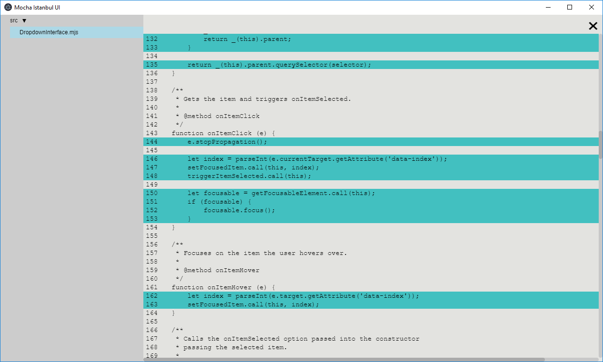

# Mocha Istanbul UI

An Electron-based testing application that runs [Mocha](https://mochajs.org/) tests along with code coverage support provided by [Istanbul](https://istanbul.js.org/).

## Motivation

Prior to running tests in the terminal, tests for web apps used to run in the browser. While the setup was tricky from time to time, the experience was pretty good. You had full access to the real DOM, and have your usual debugging experience. Terminal test runners on the other hand, were easy to setup, but had to use a fake DOM and use a remote-debugger. 

Code coverage was also another problem, typical solutions would require you to generate files to a ```coverage``` directory, and to open them up in your browser. It's far from an ideal experience.

I wanted a tool that would have the ease of using the CLI, with a fully powered DOM, a typical debugging experience, and with live code coverage that I can easily access. 




## Features

* Mocha as a test runner.
* Istanbul format for test coverage.
* Full code coverage available in the UI. See exactly what was covered immediately without needing separate files.
* Watches files for changes and automatically restarts the test cases.
* Supports CI environments with XVFB with options to print to console, run once, and generate coverage files.
* Support for setup scripts to run babel-register (including source maps) and external Istanbul instrumentation.

## How to Run

```npm install mocha-istanbul-ui```

```
{
    "test": "mocha-istanbul-ui [setup-file.js] <glob-pattern> [--flags]
} 
```

eg. ```mocha-istanbul-ui setup.js "src/*.spec.js" --instrument```

## Options

**--instrument** By default, it is assumed instrumentation is done externally. Passing this flag will instrument the code for code coverage internally.

**--console** Print test results to the console.

**--once** Execute test cases once and exit immediately. An exit code of 1 is passed if any test case fails.

**--watch** Watch for file changes. Resets tests when file changes.